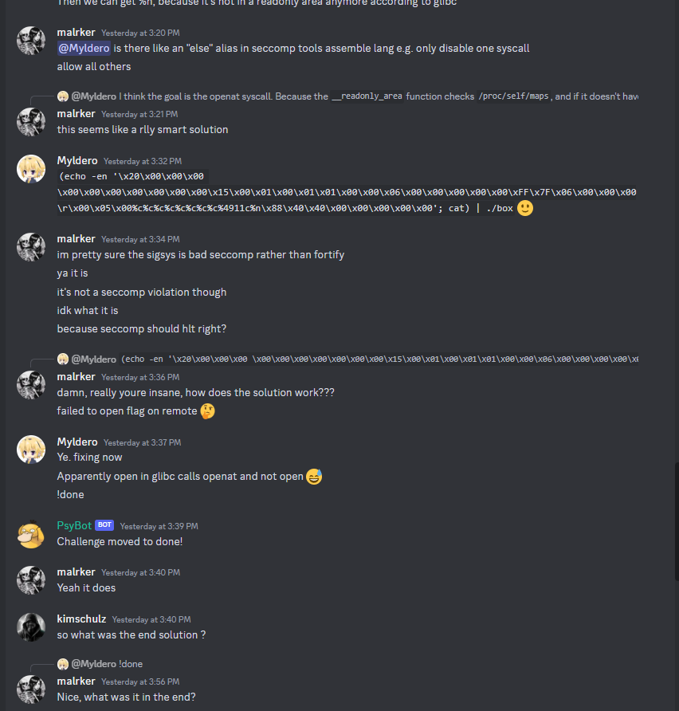
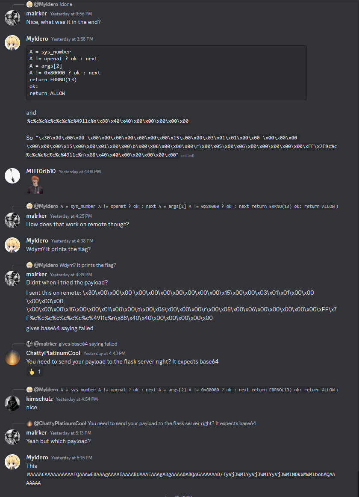
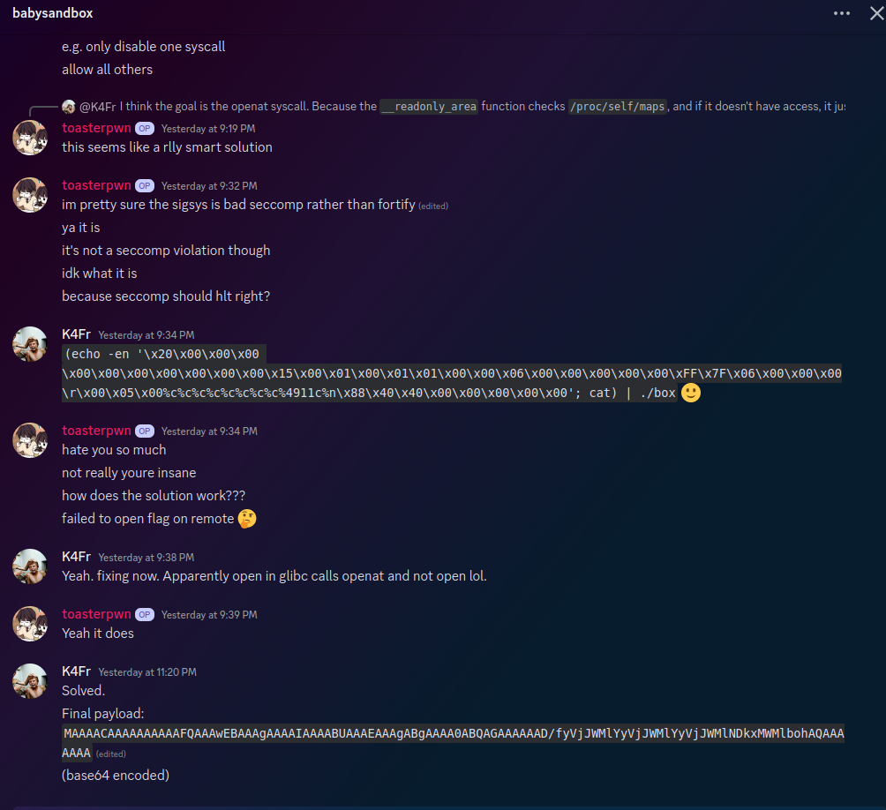
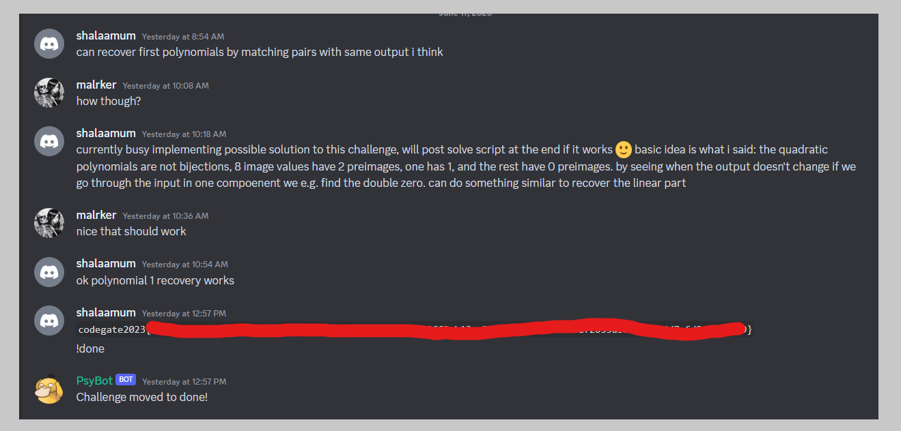
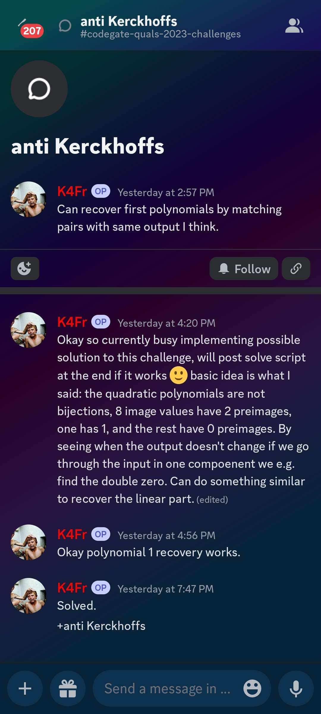
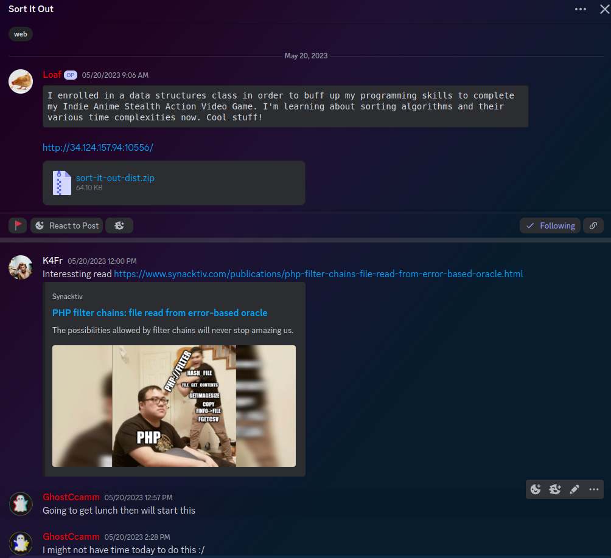
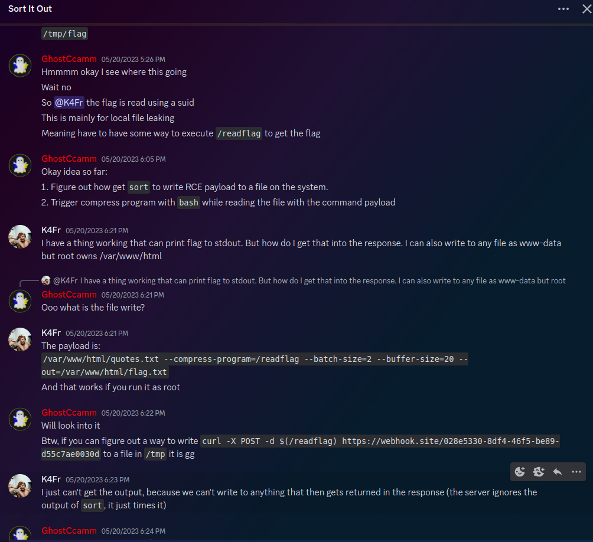
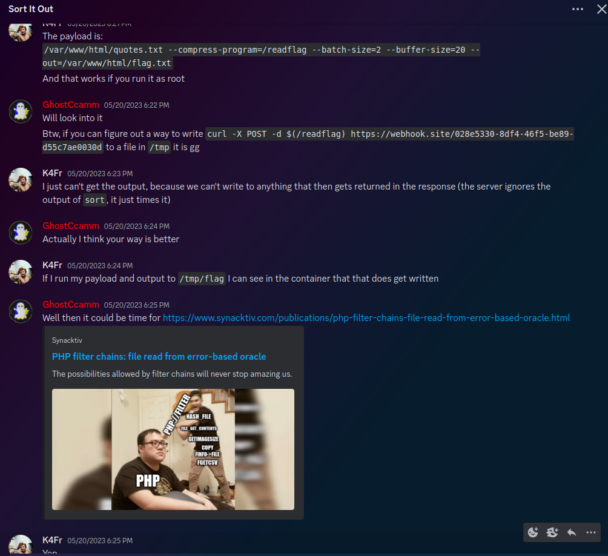
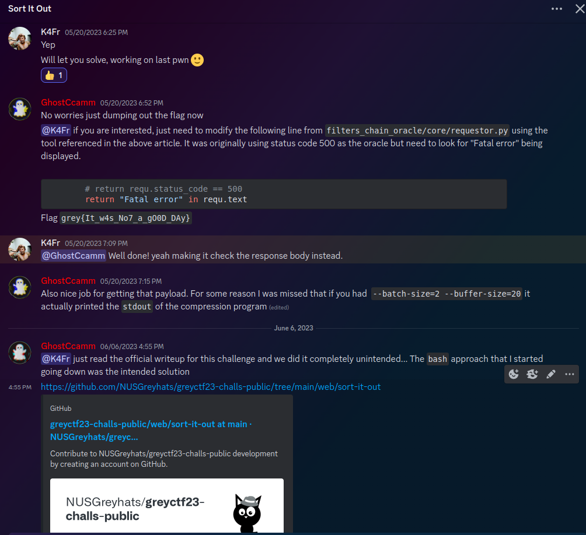

# Codegate 2023 Qualifiers statement

For those who are not aware, this weekend Kalmarunionen participated in the Codegate 2023 qualifier CTF. This is a very competitive qualifier, where the top 9 teams are allowed to attend the offline finals in Seoul, South Korea, in the fall, where they will compete for a share of a >$50k prize pool.

At the end of the competition, where we finished in 7th place, the admins made a public post claiming that we had cheated, and were disqualified from the competition, due to trading flags with the team `Emu Exploit`.

In the process of our immediate investigation we discovered that a player on our team with the discord handle `Yazarrrs#1964`, (since changed to mlkrkr before quitting our discord,) who had joined our team in April, had directly stolen the solutions to 5 challenges we solved in this competition, copying solutions and flags over to the Emu Exploit discord, where they played under the id `K4fr`.
`K4fr` had been a member of `Emu Exploit` since last november, and before that was a member of the team `thehackerscrew`.

After further investigation with the assistance of members of `Emu Exploit`, we found that this behaviour went back to at least greycats CTF, where they also appeared to be pasting links/resources from `Kalmarunionen` to `Emu Exploit` during that CTF.

The accounts involved have been immediately removed from all Kalmar related activities, and further investigation is ongoing in collaboration with other teams.
We also encourage other teams to be on the lookout for similar accounts, as we have seen some evidence that we're likely not the only team they have an account with.

Finally, Kalmarunionen would like to extend our sincere gratitude to members of the Cryptohack community, `thehackerscrew`, and especially thanks to members of `Emu Exploit`, who reached out to us with information and have assisted with our investigation over the last twelve hours. 
We would also like to extend our thanks to codegate CTF administrators for their assistance with technical information.

We would like to emphasise that members of `Emu Exploit` immediately reached out to us, and were incredibly friendly and helpful throughout the process, and we bear no ill will towards the team `Emu Exploit`.

-Kalmarunionen

For those interested, the rest of this document will contain some details of our investigation, and a brief discussion of the opsec expectations of modern online CTF teams.

## Timeline

We had a secured 7th place with a last flag coming in with 5 minutes to go, and several of our members were celebrating in voice chat until the ctf ended and we saw this:

We are immediately very confused, as anti Kerckhoff is a challenge we first blooded, and has only been solved by 5 teams the entire CTF.

Admins confirm this by noting that the challenge `anti Kerckhoffs` used dynamic flags per instance, and that `Emu Exploit` had submitted an identical flag to our team for that challenge. 

#### Ctfd Solves
Looking up `Emu Exploit`, we see the following scoreboard (some css elements deleted to show everything on one page, link here):

Compared to our solve page.

(These can be verified at https://gen.codegate2023.org/teams/265 and https://gen.codegate2023.org/teams/253 while codegate ctfd is up.)

From this it is clear that the user `K4fr` has submitted 5 flags for `Emu Exploit`, all on challenges which `Kalmarunionen` had solved, all submitted after `Kalmarunionen` had solved these challenges.

Furthermore, we confirmed that all 5 of these challenges were cases where either the full solve script or a flag had been posted in internal `Kalmarunionen` channels during the ctf, which only players with the specific access role for our internal ctf team have access to.

At this point `GhostCcamm` from `Emu Exploit` reached out to us directly, and was incredibly helpful in the following stages of the investigation. He confirmed that `K4fr` was a member of `Emu Exploit`, and had been the person on their team to solve all the challenges they submitted to CTFd.

#### IP Collision
At this point the codegate administrators revealed that they had detected an IP match on their CTFd server between the user `K4fr` on `Emu Exploit`, and the user `Yamz` on `Kalmarunionen`.

Looking at our ctfd page, all users on ctfd except for three, (`nimblemutt, yamz and abcd1234`) had used the same name on ctfd as they use on discord. This immediately made us suspicious of a relatively new member of our team, (and one of the few who was not from scandinavia), who went by the name of `Yazarrrs`, as he had been very actively posting in our channels during the ctf, so he must have had ctfd access. So one of these three accounts must be his. 

Admins helped by confirming that the `Yamz` IP was from outside europe, while `nimblemutt` and `abcd1234` were danish and Swedish IP's. 

At this point we immediately removed all roles from `Yazarrrs`, both on kalmar servers and also on `Norsecode`, our defcon team, and they were poked in DM's, and within the next hour they changed their discord name, and quit the Kalmarunionen server without any comment.

We would also like to note that at no point during this competition did `Yazarrrs` solve any challenges or submit any flags on behalf of `Kalmarunionen.` Other than very high level comments at the start of the ctf ("this is a c++ pwn" etc), and then actively following discussions and asking questions about how other players solve scripts were going through the rest of the ctf. (Evidently to pass this information on :(.)

#### Specific Challenges: Codegate 2023 babysandbox
At this point we were pretty sure `Yazarrrs` was the culprit, and together with members of `Emu Exploit`, we started comparing chat logs between the challenges on our various Servers.

One specific challenge which was very interesting was the babysandbox challenge. The following are screenshots from the `Kalmarunionen` discord server, showing one of our players (Myldero) solving the challenge, and `Yazarrrs`, (who since name changed to malrker/mlkrkr before leaving the server.)
(Note `Emu` are in australia timezone, so kalmar time is 6 horus behind.)

 
Specific points of interest:
   1. Our player pastes a shellscript, which `Yazarrrs` then claims "fails to open flag on remote."
   2. Our player acknowledges this, and states the reason as "open in glibc calls openat and not open"
   3. Our player fixes his solve script and solves the challenge. Does not paste final solve script or flag.
   4. `Yazarrrs` repeatedly asks for a final script, and despite getting multiple versions of solutions keeps asking until they get a full base64 encoded payload which they can just submit directly to server for the flag.

Now we compare to the logs from the `Emu Exploit` server. (Note they are in australia timezone, so kalmar time is 6 hours behind):

1. `K4fr` posts the exact same initial payload, 2 minutes after it was posted in Kalmarunionens discord
2. After being told it fails to open flag on remote, he pastes that question back into kalmar, and pastes our players resoponse back verbatim into `Emu Exploit`.
3. Later, (after extracting full payload from our players with repeated questions,) `K4fr` pastes that payload over into `Emu Exploit` discord and submits the flag for them.

The other 4 challenges which `K4fr` submitted for `Emu Exploit` were challenges where either a (non randomized) flag or a full solve script was posted in `Kalmarunionen` channels upon solving. And also had solutions/flags dumped in `Emu Exploit` chats out of nowhere.

For example, our discord chat around Kerchoff solution (which we first blooded) vs theirs. (Remember Emu timestamps are 6 hours ahead)

`Kalmarunionen`:

`Emu Exploit`:

Note this was the only crypto challenge with a dynamic flag, which got caught by codegate admins anticheat.

#### Previous CTFs: Greyhats web-sortitout
At this point in our discussions with members of other teams, they noted that they had also been surprised by the sudden increase in Crypto ability in the last month or so, and pointed to another example where they were very surprised by the unexpected contribution.

Here are some screenshots of the internal chat of `Emu Exploitation` from the sort it out challenge, a hard web challenge at greyhats.

Our discord bot has already archived these channels within our internal discord, however given the tip off, we decided to search out logs.

searching for these specific links in our backup:

Again resources/payloads being lifted from Kalmar channels during the ctf, and pasted into  verbatim (including typos) into `Emu Exploit` channels by `K4fr`. Also worth noting that the solution Kalmar found was an unintended, with the intended having been what `GhostCcamm` was working towards, until `K4fr` provided him with the resources for the direction `Kalmar` used to solve it.

see intended here.
https://github.com/NUSGreyhats/greyctf23-challs-public/tree/main/web/sort-it-out

Regarding Greyhats, `Kalmarunionen` didn't place that highly in greyhats, ending 15th where `Emu Exploit` ended 10th, with `K4fr` allegedly also submitting flags from challenges `Kalmarunionen` didn't solve.

It is unknown whether `K4fr` solved these challenges honestly, or has more alts in other team discords where they lifted solutions from.

## Opsec: "Just vet your members"
An ongoing discussion point in the fallout of this has been that teams should be responsible for vetting their own members, and any situation where someone leaks flags is the result of improper opsec.

To be clear, Kalmarunionen does have onboarding processes. The vast majority of our members are people we've met in person at various meetups, or directly referred to the team by current members who know them very well. 

In addition to this, we have brief onboarding interviews for the majority of new members and multiple permission levels for different levels of access to social/ctf channels. Pick any member of our discord and we can link you to who refered them, and likely their specialisations/background/name and the last meetup they attended in person!

The following is a timeline of our teams interactions with `Yazarrrs`.

In January, `Yazarrrs` directly reached out to Zanderdk, one of `Kalmarunionen`'s administrators, and a pwn specialist, who is relatively well known among pwners. Zanderdk was a little confused about the message, (see him asking a few of us if we knew him :sweat_smile:,) 

After this point, they started a rapport, exchanging messages weekly on the topic of advanced binary exploitation. At the time `Zanderdk` believed he was talking to another strong pwn player over an honest shared interest. (Note,  we now suspect that these messages might have just been `Yazarrrs` forwarding questions and responses back and forth between other Pwn specialists) 

These communications continued for multiple months, until April, when they expressed interest in playing a ctf with us, and on April 10th they joined our discord.

(unfortunately given the very public announcement and investigation, `Yazarrrs` was able to delete all their direct message with Zanderdk before we could back them up.)

After a few more weeks, and `Yazarrrs` joined us as a playing guest, (a temporary role permission we have for single events) in a few CTF's, they did not contribute many (if any) flags, but were active in chat channels. Including a lot of activity during JustCTF, (where we didn't have many people playing.) And now Codegate CTF.

This was also a period of time where many administrative members of Kalmarunionen were very busy with the organization of both the NORSECODE defcon qualifiers meetup (flying people in from around scandinavia for a 50 man meetup in copenhagen), as well as heavy involvement in the national qualifiers for the Danish ECSC team, which both landed in May. This may have led to there being less of an overview of who was playing what in what events over this brief period of time, which also made strange behaviour fly under the radar.

During this time `Yazarrrs` also maintained private conversations with multiple pwn players from our team, who believed him to be a new member of Kalmarunionen. (In retrospect, after internal discussions, some have also commented that he started asking invasive questions relating to specific security research our members were carrying out outside of CTF's, which led to some of them ceasing communication with him in the last week or two.)

We are curious how other top CTF teams, (especially those primarily online/discord based,) feel they would have handled a situation like this. Where a seemingly talented cybersec expert befriends some of your members over a period of several months, then joins your discord seemingly in good faith and starts playing events with you as a guest.

#### Kalmarunionen
Kalmarunionen was founded in 2020, when few seperate groups of university students and cybersec talents decided they wanted more friends to play and learn with, and created a joint discord. 

Ever since then, one of our goals has always been to make a space where talented and ambitious scandinavian security talent can play together with the best in the region. And even as we've risen in the international rankings and become more competitive, we've always balanced our competitive aspirations with our desire to onboard and teach the next generation. 

Seeing highschoolers with no hacking experience hear about us through SoMe, start coming to our meetups and events, sitting beside some of our top pwn/web players, then one or two years later being on the Danish national team lifting the ECSC trophy. Or events like the meetup we hosted for Norsecode's DefCon qualifiers, where we flew in top talents from around scandinavia, and had top players from Sweden, Finland, Norway and Iceland playing side by side with us, resulting not only in a defcon qualification, but what we hope to be a closer and stronger scandinavian security community going forward.

We have always been aware that balancing being an internationally competitive cybersecurity team, with being welcoming environment for beginners to learn in is a challenge. 
While we will definitely take this as a learning experience, and look into what we can improve internally to try and prevent something similarfrom happening again, we also do not believe that access to cybersecurity knowledge/skills are something which should be hoarded and hidden away, and we remain proudly committed to doing what we can to build the best and strongest scandinavian cybersecurity community that we can.

